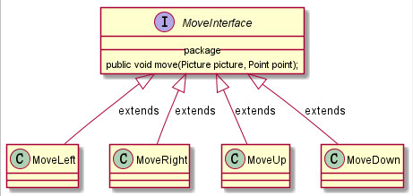
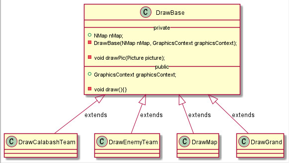
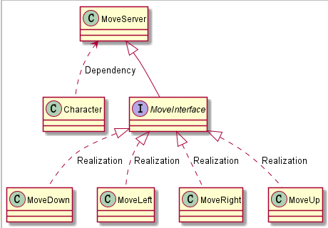
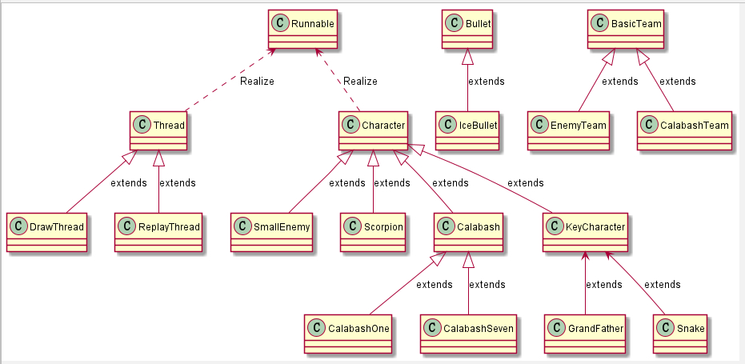
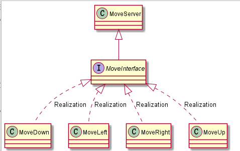
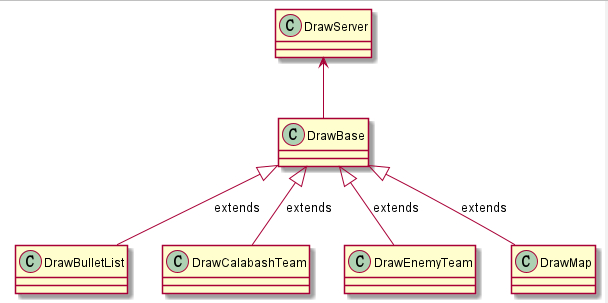
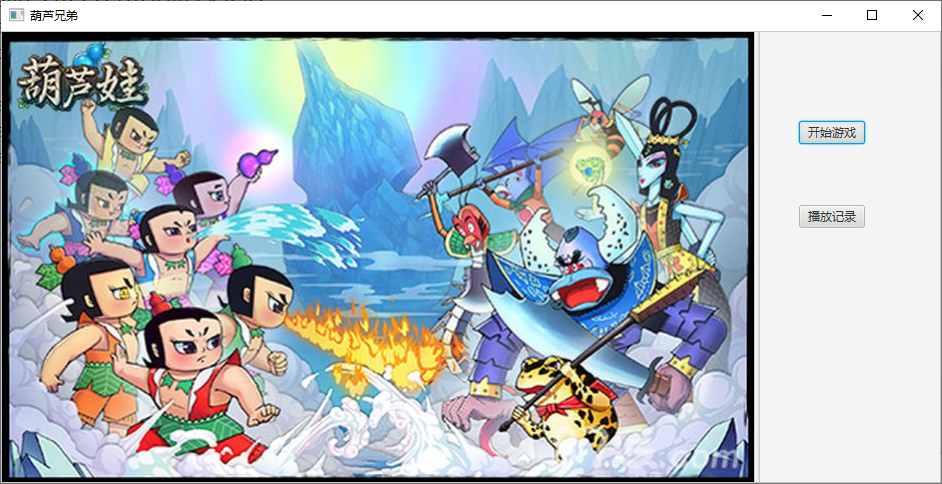
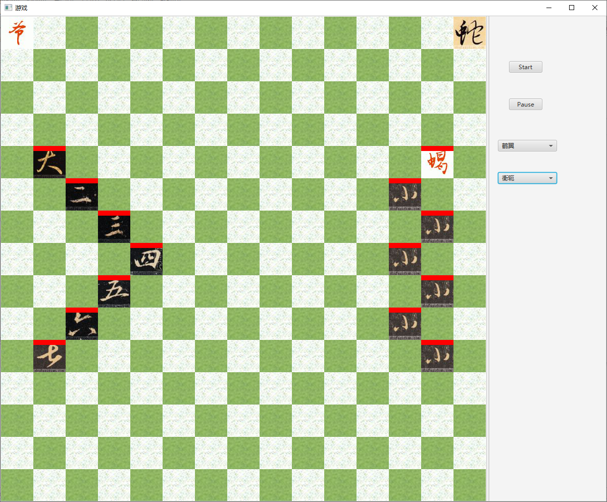
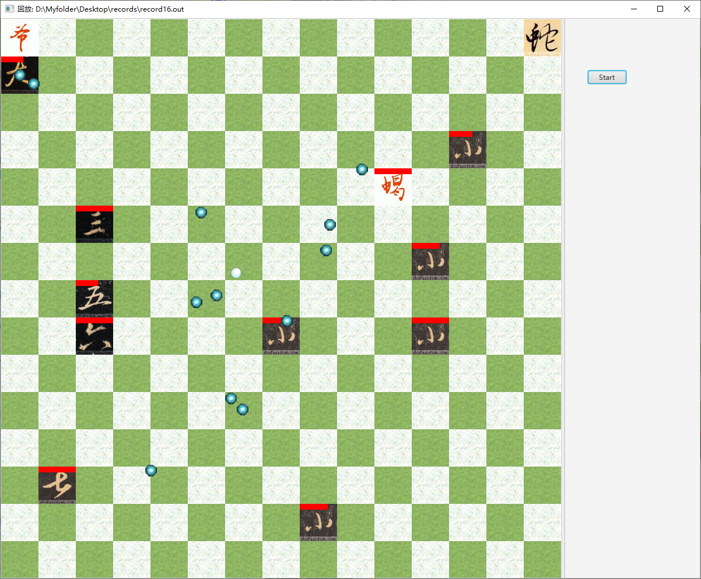

# 葫芦娃大战妖精

## 使用到的面向对象特性

1. **封装，继承**：
    * 封装**人物基类**：`Character`，所有地图上的生物(葫芦娃，老爷爷，蛇精，小喽啰，蝎子精)均(直接/间接)继承自Character。
    * 封装**关键人物基类**：`KeyCharacter`，继承自`Character`，表示一个队伍中的**关键人物**，是老爷爷和蛇精的父类。
    * 封装**葫芦娃基类**：`Calabash`，七个葫芦娃(`CalabashOne`~`CalabashSeven`)均继承自`Calabash`。
    * 封装**队伍基类**(**泛型**)：`BasicTeam`，用于统一管理**葫芦娃队伍和敌人队伍**。每支队伍拥有一个**领队者**和**一队士兵**。葫芦娃队伍(`CalabashTeam`)和敌人队伍(`EnemyTeam`)均**实例化**`BasicTeam`。
    * 封装**子弹基类**：`Bullet`，寒冰弹(`IceBullet`)继承自`Bullet`
    * 封装**纪录类**：`Record`，用于保存需要记录的内容。
    * 封装**地图类**：`NMap`，用于提供全局的地图访问。
2. **多态**
    * 用`Calabsh`列表统一管理所有的葫芦娃，用`SmallEnemy`列表统一管理所有的小喽啰和蝎子精。在程序中使用`Character`统一管理所有的生物。
    * `Character`提供基本`run()`方法，空`selectOneEnemy()`，`attacked()`方法，子类**重写**(**Override**)各自对应的方法，实现不同生物的操作的动态绑定。


## 使用到的Java特性

1. #### 泛型

    * <font color=ff0000>队伍基类`BasicTeam`中使用**泛型设计**</font>，领队者继承`KeyCharacter`，士兵继承`Character`。

        ```java
        public class BasicTeam <T1 extends KeyCharacter, T2 extends Character>{
            protected T1 keyCharacter;           //关键人物，老爷爷或蛇精
            protected List<T2> normalTeam;       //普通队伍，葫芦娃或小喽啰
        }
        ```

    * 葫芦娃队伍`CalabashTeam`和敌人队伍`EnemyTeam`分别**实例化**`BasicTeam`。

        ```java
        public class CalabashTeam extends BasicTeam<GrandFather, Calabash>{}	//葫芦娃
        public class EnemyTeam extends BasicTeam<Snake, SmallEnemy>{}			//敌人
        ```

2. #### 注解

    * **<font color=ff0000>自定义角色属性注解，子弹属性注解</font>**，均作用于类属性上，保留范围是`RUNTIME`。

    * **角色属性注解**有`Blood`一个属性，表示人物的初始血量。

    * **子弹属性注解**有`attackPower`，`speed`两个属性，表示子弹的攻击力和速度。

    * 将**注解和工厂模式一起使用**，统一管理所有的属性。

        ```java
        //子弹属性
        @Target(ElementType.FIELD)
        @Retention(RetentionPolicy.RUNTIME)
        public @interface BulletAttributes {
            int attackPower() default 2;			//攻击力
            int speed() default 4;					//速度
        }
        //角色属性
        @Target(ElementType.FIELD)
        @Retention(RetentionPolicy.RUNTIME)
        public @interface CharacterAttributes {
            int blood() default 5;              	//血量
        }
        ```

        ```java
        //在队伍工厂TeamFactory中，与之配合：
        public class TeamFactory{
            @CharacterAttributes
            private static int calabashOneAttr;		//大娃属性
            @CharacterAttributes(blood = 4)
            private static int calabashTwoAttr;		//二娃属性
            ......
        }
        ```
        
    * 在单元测试时使用`@Test`，`@BeforeClass`等注解，以及项目中的`@override`注解等。

3. #### I/O流

    * <font color=ff0000>读取人物，地图，子弹的图片使用**I/O**流完成。读取队伍位置列表也使用**I/O**流完成。</font>

    * 使用`InputStream`将图片资源作为输入流入读。

    * 使用`Scanner`从位置列表文件中依次读入整型数。

    * **使用了`Java7`后*try-with-resources*的异常处理方式。**

        ```java
        //try-with-resources
        try(InputStream is =	fileClassLoader.getResourceAsStream(imageProperties.getProperty(name))){
            return is == null ? null: new Image(is);	//读取文件
        }
        ```

4. #### 序列化

    * <font color=ff0000>**记录的保存与读入**使用序列化实现，实现`Serializable`接口。</font>

    * 每个记录中保存该帧的葫芦娃队伍，敌人队伍和子弹列表。

    * 对于不需要的属性，使用`transient`修饰，不进行序列化。`javafx`中的`Image`无法进行序列化。

        ```java
        public class Record implements Serializable {}		//记录，可序列化
        //序列化
        objectOutputStream.writeObject(record);
        objectOutputStream.flush();
        //反序列化
        Record record = (Record)objectInputStream.readObject();
        ```

5. #### 类型，自省与加载

    * <font color=ff0000>**通过反射读取注解中的内容。**</font>

        ```java
        CharacterAttributes characterAttributes = TeamFactory.class.getDeclaredField(fieldName).getAnnotation(CharacterAttributes.class);											//反射读取注解
        int blood = characterAttributes.blood();
        ```

    * 通过**类加载器**加载资源文件，作为输入流进行输入。

        ```java
        ClassLoader fileClassLoader = FileUtils.class.getClassLoader();	//加载器
        InputStream is = fileClassLoader.getResourceAsStream(path);
        ```

6. #### 异常

    * <font color=ff0000>对于各类异常进行了处理，**打印对应异常栈和特殊输出**，便于调试。</font>

        ```java
        try(InputStream is = fileClassLoader.getResourceAsStream(formationProperties.getProperty(name))){
        } catch (IOException e) {
            System.out.println(name + "位置文件读取错误");
            e.printStackTrace();
        }
        ```

7. #### 并发编程

    * **每个人物**为一个线程，其中移动和攻击分别为一个线程。
    * **所有子弹列表**单独为一个线程。
    * **绘制画面**和**重放画面**分别为一个线程。
    * 使用`synchronized`来控制访问，`wait()`和`notifyAll()`来等待和唤醒线程。

8. #### Lambda

    * 在`javafx`框架的控件操作实现中，使用`Lambda`表达式代替对象。

    * 多线程并发时使用`Lambda`表达式代替`Runnable`对象。

        ```java
        MapCanvas.setOnKeyPressed(event -> {……});
        new Thread(() -> {……});
        ```

9. #### 内部类

    * **绘画线程**和**重放线程**为私有内部类，仅能被对应的绘画类访问。

        ```java
        public class ReplayPaint{
            ……
        	private class ReplayThread extends Thread{}	//内部类
        }
        ```

10. #### 构建与测试

    * 使用`maven`构建，并针对关键方法做了**单元测试**，具体见后续。

11. #### GUI编程

    * 项目使用`javafx`+`fxml`+`scene builder`进行图形化编程。


## 使用到的设计原则

* #### OCP，开放封闭原则

    * 画图抽象出**画图基类**`DrawBase`，每个具体需要绘制的事物(人物/子弹)实现绘图实现类，继承`DrawBase`，这样在有新的需要绘制的人物时只需要从`DrawBase`中派生出一个新的类即可，**不需要改动原来的代码**，遵循了**OCP**原则。

    * 人物移动抽象出移动接口`MoveInterface`，四个方向的移动具体实现移动接口，这样在新增加移动方式时，**不用修改原来的代码**，只用增加新的派生类即可，遵循**OCP**原则。

    * 结构示意如下：

        ```java
        //基类：DrawBase
        public class DrawBase{
            void drawPic(Picture picture);		//绘制一个图片
            public void draw();					//绘制具体的一个对象，用于派生类重写
        }
        //派生类：葫芦娃队伍
        public class DrawCalabashTeam extends DrawBase{
            private CalabashTeam calabashTeam;	//需要绘制的对象：葫芦娃队伍
            public void draw();					//重写方法，绘制葫芦娃逻辑
        }
        ```

    * 类图如下：

        
        
        

* #### DIP，依赖倒置原则

    * 增加**抽象服务类**`DrawServer`，高层`GamePaint`**依赖于`DrawServer`类**，不直接依赖于各个底层绘图类，**两者间的交互通过`DrawServer`抽象层**，遵循了**DIP**原则。

    * 结构示意如下：

        ```java
        //上层，依赖抽象层而非具体层
        public class GamePaint {
        	private DrawServer drawServer;			//画图抽象层
        }
        
        //绘画服务，提供给上层
        public class DrawServer{
            public void draw(DrawBase drawBase){	//使用基类参数，子类替换基类
                drawBase.draw();
            }
        }
        ```

    * 以来结构示意图如下：

        

* #### LSP，`Liskov`替换原则

    * `DrawServer`类中**参数为基类DrawBase对象**，而不是各个具体的派生类，实际调用时用子类型代替基类型，调用各自重写的绘制方式，实现了**一个`draw()`函数完成所有具体派生类的绘画**，遵循了**LSP**原则。

        ```java
        public class DrawServer {
            public DrawServer(){}
            /**
             * 画图，遵循DIP原则
             * @param drawBase
             */
            public void draw(DrawBase drawBase){
                drawBase.draw();
            }
        }
        ```

    * 用`Calabsh`列表统一管理所有的葫芦娃，用`SmallEnemy`列表统一管理所有的小喽啰和蝎子精。**多态的使用体现了LSP原则。**


## 使用到的设计模式

* #### 简单工厂模式

    * **葫芦娃队伍**和**敌人队伍**的产生使用**工厂**：`TeamFactory`，将人物的产生统一，并与注解配合，完成不同人物属性的改变。

    * **子弹的产生**使用**工厂**：`BulletFactory`，将普通子弹的产生和寒冰弹的产生统一，避免了频繁分布的的`new`操作，并与注解配合，完成不同子弹属性的改变。

    * 子弹工厂代码示例如下：

        ```java
        //子弹工厂
        public class BulletFactory {
        	//子弹属性，使用注解
            @BulletAttributes
            private static int NormalBulletAttr;		//普通子弹
            @BulletAttributes(attackPower = 3, speed = 6)
            private static int IceBulletAttr;			//寒冰弹
        	//generate方法，生产不同的子弹
            public static Bullet generateBullet(){}
            public static IceBullet generateIceBullet(){}
        }
        ```

* #### 装饰器模式

    * 在**I/O**流`Scanner`中使用装饰器模式，将`InputStream`装饰成为`Scanner`。

* #### 原型模式

    * 关键人物`KeyCharacter`实现了`Cloneable`接口，重写`clone()`方法，实现了<font color=ff0000>**快速深拷贝**</font>。

        ```java
        public class KeyCharacter extends Character implements Cloneable{
            …………
            @Override
            public Object clone() throws CloneNotSupportedException {
                Object obj = super.clone();
                ((KeyCharacter)obj).picture = (Picture) this.picture.clone();	//属性拷贝
                ((KeyCharacter)obj).point = (Point) this.point.clone();			//属性拷贝
                return obj;
            }
        }
        ```

* #### 观察者模式

    * 在`javafx`控件中使用观察者模式，**监控键盘按键按下事件**。

        ```java
        MapCanvas.setOnKeyPressed(event -> {……})
        ```

* #### 模板方法模式

    * **`javafx`的应用程序使用了模板方法**，模板固定了应用开始时的顺序(必须调用`start()`方法)，在程序中重写对应的`start()`可变部分。

* #### MVC模式

    * 即**Model View Controller**模式，将业务逻辑，数据和界面显示分离。
    * 在我的程序中，**MVC三者代码分离，耦合度较低**：
        * `Model`：包含人物，子弹，队伍，地图等基本控制模型。
        * `View`：用于开始/游戏/回放界面的设计和游戏中的绘图设计。
        * `Controller`：用于控制对象的产生，记录的序列化/反序列化，游戏的开始/暂停等逻辑。
    * `Model`，`View`，`Controller`三者的关系如下：
        * `View`监听用户的按键，点击等操作，调用`Controller`给出的方法，并实时绘制图形。
        * `Controller`产生对应的`Model`，并调用`Model`中提供的方法，完成逻辑的控制。


## 程序结构说明

#### 整体继承结构

* `Model`继承体系



* **DIP**原则继承体系





### 1. Main类

* 应用程序的入口，新建窗口，导入`Opening.fxml`文件，进入开始画面。

### 2. `java.view`包

* `controller`包
    * **三个界面FXML文件对应的类**，分别为：
        * `OpeningController`：选择界面，可以选择进入游戏界面或回放界面。
        * `GameController`：游戏界面，监听键盘按键和鼠标点击，进行游戏。
        * `ReplayController`：回放界面，监听鼠标点击，进行回访。
* `draw`包
    * 绘制各种**实体**的接口。
* 两个用于绘制游戏战场的类，**多线程绘制**，分别为：
    * `GamePaint`：**游戏**绘制类
    * `ReplayPaint`：**回放**绘制类

### 3. `java.model`包

* `basic`包

    * 项目中的**基类**和一些**辅助类型**(Point，Picture等)。

        ```java
        class BasicTeam						//队伍基类
        class Bullet						//子弹基类
        class Character						//人物基类
        class KeyCharacter					//关键人物基类
        class Record						//纪录类
        ```

    * 每一个`Character`为一个单独的线程，重写`run()`方法。基本的**运动逻辑**为：
        * 新建线程，每隔**1.5s**随机一个方向移动。
        * 原`run`线程每隔**5s**随机选择一个敌人，发射一枚普通子弹。
    * 在纪录`Record`类的实现中，由于`Image`无法序列化，故序列化时略去`Image`，并提供`setImage()`方法为反序列化后的对象增加对应的图片。

* `good`包

    * **葫芦娃队伍**中的成员

        ```java
        class GrandFather					//老爷爷
        class CalabashOne					//大娃
        class CalabashTwo					//二娃
        ……
        class CalabashSeven					//七娃
        ```

    * 老爷爷不直接参与战斗，重写`run()`方法，每隔**8s**给所有未阵亡的葫芦娃**增加1滴血**。
    * 大娃每次向**同一敌人发射两枚子弹**，二娃**血量少但移动速度快，攻击速度快**，三娃**血量多**，五娃能够**发射寒冰弹**。

* `enemy`包

    * **敌人队伍**中的成员

        ```java
        class SmallEnemy					//小喽啰
        class Snake							//蛇精
        class Scorpion						//蝎子精
        ```

    * 蛇精不直接参与战斗，蝎子精拥有**更多的血量**。

* `bullet`包

    * 子弹类型

        ```java
        class IceBullet						//寒冰弹
        class Bullet						//普通子弹
        ```

    * 寒冰弹在命中敌人后敌人会无法行动和攻击**7s**。

* `controlled`包

    * 程序中实际被控制的实体，包括**葫芦娃队伍，敌人队伍，子弹列表和地图**。

        ```java
        class BulletList					//子弹列表
        class CalabashTeam					//葫芦娃队伍
        class EnemyTeam						//敌人队伍
        class NMap							//地图
        ```

    * `BulletList`类中包含所有的子弹，为一个**单独的线程**。
        * 在该线程中，每隔固定时间遍历子弹列表，移动每个子弹。
        * 若超出边界，则将其移除。
        * 若未超出边界，则判断子弹该位置是否有敌人，若有则子弹移除，敌人被攻击。若没有，则继续下一次移动。

* `annotation`包

    * **自定义的注解类型**。

        ```java
        public @interface BulletAttributes		//子弹属性
        public @interface CharacterAttributes	//人物属性
        ```

* `move`包
  
    * 人物移动接口，用于提供给Character作人物移动。

### 3. `java.control`包

* `Control`类
    * 调用`factory`包中的工厂**新建对应的队伍**，并通过线程调度**控制程序开始和暂停逻辑**。
* `factory`包
    * 子弹工厂和队伍工厂类，用于**产生对应的对象**。
* `utils`包
    * `FileUtils`类：**图片**读取，**位置文件**读取工具
        * <font color=ff0000>使用`Properties`文件进行读取，在`Properties`文件中通过**键-值对**确定图片的路径，读取图片。</font>
    * `RecordUtils`类：**记录**的存储与读取
        * 利用**序列化**和**反序列化**进行记录的存取。
    * `ConstValues`类：项目中使用到的**常量**，比如：各个线程sleep的时间，各种图片的尺寸等，便于统一管理所有的常量。
        * 利用`public static`类型变量，直接通过`ConstValue`类进行访问。


## 单元测试说明

* 针对**注解的读取**进行了单元测试，测试能否正确读取注解内给出的属性。
* 针对**文件的读取**进行了单元测试，测试能否正确根据名称读取`Image`文件和`PointList`文件，以及在给出错误名称时能否正常抛出异常。
* 针对**`properties`的读取**进行了单元测试，测试能否正确使用`Properties`对象根据`Image`名称读取`Image`路径，根据`PointList`名称读取`PointList`路径，以及相应的异常能否正确抛出。


## 游戏使用说明

* 在**IDEA**中打开项目，`javaSE 8`开发环境。

* 葫芦娃队伍特性：

    * 老爷爷每隔**8s**给所有葫芦娃回复**1**滴血。
    * 大娃每次能向同方向发射**两颗子弹**。
    * 二娃**移动速度和攻击速度更快**，但**血量较低**。
    * 三娃**血量很高**。
    * 五娃能够发射**寒冰弹**。

* 敌人队伍特性：

    * 小喽啰拥有比葫芦娃**更多的血量**，蝎子精拥有**最多血量**。

* 运行程序，得到**初始界面**，可以选择**开始新的游戏**或**读取游戏记录**。

    

* 点击开始游戏按钮，则进入**开始游戏窗口**。地图大小为**960\*960**，窗口大小为**960\*1200**。为**15\*15**的方格。

    * 首先弹出文件选择器，选择**保存的路径**。
    * 点击按钮或按下空格键**开始游戏**。点击按钮或再次按下空格键则**暂停游戏**。
    * 开始游戏前，点击对应的`ChoiceBox`可以更换葫芦娃和敌人队伍的**阵型**。

    
    * **游戏画面**：

    

* 点击回放按钮，则进入**回放游戏窗口**。

    * 首先弹出文件选择器，**选择记录文件**。
    * 点击**开始**回放即可。<font color=#ff0000>回放记录文件在`record`文件夹中！</font>
    * 回放画面：

    

